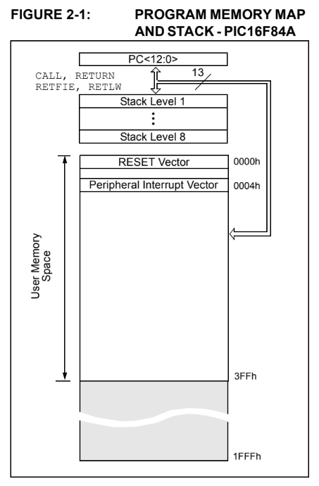
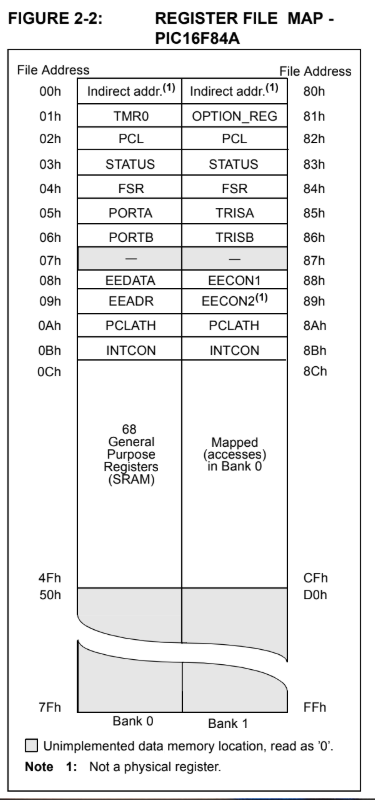
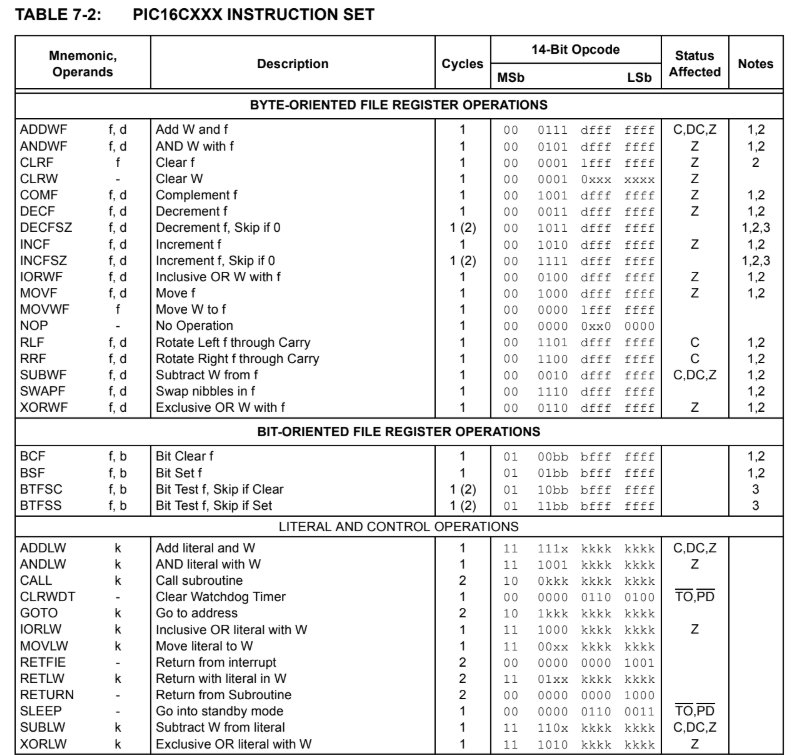

# PIC16F84A assembly

## Labels

-

### 1. Reset/Start

- Usually called `Start` or `Reset`
- Marks the beginning of program execution

``` asm
Start
  ; initialization code here
```

### 2. Setup / Initialization Label

- Optional but common (`Setup` or `Init`)
- Used for configuring TRIS regesters, ports, STATUS bits

``` asm
Setup
  bsf STATUS, 5
  movlw 0x00
  movwf TRISB
```

### 3. Main Program Loop

- Usually called `Main` or `Loop`
- Contains the main logic of your program
- Often an infinite loop using `GOTO Main`
  
``` asm
Main
  movlw 0xFF
  movwf PORTB
  call delay
  goto Main
```

### 4. Subroutine / Function Labels

- Any callable routines like `delay`, `BlinkLED`, `ReadSwicth`.

``` asm
delay 
  ; nested loops for timing
  return
```

### 5. Data / Variable Labels (optional)

- Labels for memory locations or constants, often used with `equ` or `cblock`
  
``` asm
val1 equ 0ch
val2 equ 0dh
```

- Can also define RAM locations using `cblock` if needed

``` asm
cblock 0x20
  counter
  temp
endc
```

### 6. End of Program

- Use the `end` directive

``` asm
end
```

- Marks the end of the source files for the assembler

## PIC16F84A Program Memory Map and Stack



- 0000h - 0004h: System Vectors
  - 0000h - Reset Vector -> Program starts here after power-on or reset
  - 0004h - Interrupt Vector -> Program jumps here if an interrupt occurs
    - is not used in simple examples without interrups
- 0004h - 03FFh: User Memory Space
  - Space for your program instructions
  - All `Start`, `Setup`, `Main`, and subroutines labels resides here.
  - Essentially where your application code lives
- Stack
  - Hardware stack is 8-level deep
  - Stores **return addresses for subroutines (`CALL`/`RETURN`)**
  - Overflow connot be detected--carful with too many nested calls

## PIC16F84A - REGISTER FILE MAP



### Memory Banks

- Bank 0: 00h-7Fh
- Bank 1: 80h-FFh
- Prefix "8" **in Bank 1** = Bank 1 mirror of Bank 0 addresses (offset by 0x80)

### Special Function Registers (SRFs)

#### SRFs - Bank 0

| File Addr | SFR    | Function                                            |
| --------- | ------ | --------------------------------------------------- |
| 00h       | INDF   | Indirect address via FSR                            |
| 01h       | TMR0   | Timer0 counter                                      |
| 02h       | PCL    | Program counter low byte                            |
| 03h       | STATUS | Status flags (carry, zero, RP0/RP1 for bank select) |
| 04h       | FSR    | File select register (indirect addressing)          |
| 05h       | PORTA  | Port A I/O                                          |
| 06h       | PORTB  | Port B I/O                                          |
| 07h       | EEDATA | EEPROM data                                         |
| 08h       | EEADR  | EEPROM address                                      |
| 09h       | PCLATH | PCL high byte (for program jumps)                   |
| 0Ah       | INTCON | Interrupt control                                   |
| 0Ch–7Fh   | GPR    | General Purpose Registers (SRAM)                    |

#### SRFs - Bank 1 (mirror with offset 0x80)

| File Addr | SFR         | Function                         |
| --------- | ----------- | -------------------------------- |
| 80h       | INDF        | Same as Bank0                    |
| 81h       | OPTION\_REG | Configure Timer0 & prescaler     |
| 82h       | PCL         | Program counter low byte         |
| 83h       | STATUS      | Bank 1 view (TRISA/TRISB access) |
| 84h       | FSR         | File select register             |
| 85h       | TRISA       | Port A direction control         |
| 86h       | TRISB       | Port B direction control         |
| 87h       | EECON1      | EEPROM control                   |
| 88h       | EECON2      | EEPROM control (not physical)    |
| 89h       | PCLATH      | High byte for program counter    |
| 8Ah       | INTCON      | Interrupt control                |

### Notes

- Unemplemented addresses -> reading returns 0
- Indirect addressing -> Via INDF + FSR
- General Purpose Registers (GPRs) -> user storage, starts after SFRs

### Memory offset Logic

- Bank 1 addresses = Bank 0 addresses + 0x80
- Accessing TRIS registers requires selecting Bank 1 (`STATUS, RPO = 1`)

## PIC16 Assembly Instructions



### Actors and Actions

#### 1. Actors

- **W (Working Register):** Central CPU register for operations, like an accumulator
- **f (File Register):** General purpose registers (GPR) or Special Function Registers (SFR)
- **b (Bit position):** Used in bit-oriented instructions
- **k (Literal value):** Constant values used in instructions

#### 2. Byte-Oriented File Register Operations

| Mnemonic | Description                  | Operands | Status Affected |
| -------- | ---------------------------- | -------- | --------------- |
| `ADDWF`  | Add W and f                  | `f,d`    | C, DC, Z        |
| `ANDWF`  | AND W with f                 | `f,d`    | Z               |
| `CLRF`   | Clear f                      | `f`      | Z               |
| `CLRW`   | Clear W                      | -        | Z               |
| `COMF`   | Complement f                 | `f,d`    | Z               |
| `DECF`   | Decrement f                  | `f,d`    | Z               |
| `DECFSZ` | Decrement f, skip if 0       | `f,d`    | Z               |
| `INCF`   | Increment f                  | `f,d`    | Z               |
| `INCFSZ` | Increment f, skip if 0       | `f,d`    | Z               |
| `IORWF`  | Inclusive OR W with f        | `f,d`    | Z               |
| `MOVF`   | Move f                       | `f,d`    | Z               |
| `MOVWF`  | Move W to f                  | `f`      | -               |
| `NOP`    | No operation                 | -        | -               |
| `RLF`    | Rotate left f through carry  | `f,d`    | C               |
| `RRF`    | Rotate right f through carry | `f,d`    | C               |
| `SUBWF`  | Subtract W from f            | `f,d`    | C, DC, Z        |
| `SWAPF`  | Swap nibbles in f            | `f,d`    | -               |
| `XORWF`  | Exclusive OR W with f        | `f,d`    | Z               |

#### 3. Bit-Oriented File Register Operations

| Mnemonic | Description               | Operands | Notes      |
| -------- | ------------------------- | -------- | ---------- |
| `BCF`    | Bit clear f               | `f,b`    | 1 cycle    |
| `BSF`    | Bit set f                 | `f,b`    | 1 cycle    |
| `BTFSC`  | Bit test f, skip if clear | `f,b`    | 1–2 cycles |
| `BTFSS`  | Bit test f, skip if set   | `f,b`    | 1–2 cycles |

#### 4. Literal & Control Operations

| Mnemonic | Description                 | Operands | Notes    |
| -------- | --------------------------- | -------- | -------- |
| `ADDLW`  | Add literal and W           | `k`      | 1 cycle  |
| `ANDLW`  | AND literal with W          | `k`      | 1 cycle  |
| `CALL`   | Call subroutine             | `k`      | 2 cycles |
| `CLRWDT` | Clear watchdog timer        | -        | 1 cycle  |
| `GOTO`   | Go to address               | `k`      | 2 cycles |
| `IORLW`  | Inclusive OR literal with W | `k`      | 1 cycle  |
| `MOVLW`  | Move literal to W           | `k`      | 1 cycle  |
| `RETFIE` | Return from interrupt       | -        | 2 cycles |
| `RETLW`  | Return with literal         | `k`      | 2 cycles |
| `RETURN` | Return from subroutine      | -        | 2 cycles |
| `SLEEP`  | Standby mode                | -        | -        |
| `SUBLW`  | Subtract W from literal     | `k`      | 1 cycle  |
| `XORLW`  | Exclusive OR literal with W | `k`      | 1 cycle  |

#### Summary

- `MOVLW` => "load a literal value into W"
- `MovLF` => "store W into a file register f"
- `BSF/BCF` => manipulate a single bit in register
- `CALL/RETURN` => subroutine control
- **Cycle counts matter** for timing/delays
- **Status bits (C, DC, Z)** are updated automatically by arithmetic/logical operations

## Basic Patterns

### 1. Loading and Storing Data

- **Instructions:** `MOVLW`, `MOVWF`, `MOVF`
- **Pattern:** `W` acts like temporary register. Always load a value into `W` first, then store it somewhere

``` asm
movlw 0xFF    ;Load literal into W
movwf PORTB   ;Store W into PORTB register
```

### 2. Bit Manipulation

- **Instructions:** `BSF`, `BCF`, `BTFSS`, `BTFSC`
- **Pattern:** Used for turning on/off LEDs, reading button flags

``` asm
bsf PORTB, 0 ; Set but 0 of PORTB high (turn on LED)
bcf PORTB, 0 ; clear bit 0 (turn off LED)
```

### 3. Delay Loops

- **Instructions:** `DECFSZ`, `GOTO`, `NOP`
- **Pattern:** Simple software delays with nested loops, Used before learning timers

``` asm
movlw 0xFF
movwf count1
loop1:
decfsz count1, 1
goto loop1
```

### 4. Conditional Execution / Skipping

- **Instrcutions:** `BTFSS`, `BTFSC`, `DECFSZ`
- **Pattern:** Check a bit or register, skip next instruction is met. Often used for buttons or checking flags

``` asm
btfss PORTA, 0 ; if button is not pressed, skip next instruction
goto ButtonPressed
```

### 5. Loops (Counting Patterns)

- **Instrcutions:** `DECFSZ`, `INCFSZ`, `GOTO`
- **Pattern:** Loop over instructions until a counter reaches zero. `for` loop equivalent

``` asm
movlw 0x0A
movwf counter
loop:
  bsf PORTB, 0
  call delay
  bcf PORTB, 0
  call delay
  decfsz counter, 1
  
goto loop
```

### 6. Subroutine / Modular Code

- **Instructions:** `CALL`, `RETURN`, `RETLW`
- **Patterns:** Break code into reusable blocks like delay functions or other repeated actions

``` asm
call delay ; Jump to delay subroutine
....
delay:
  ; Delay subroutine
return
```

### 7. Using the Status Registry

- **Instrucitons:** `BCF STATUS, 5`, `BSF STATUS,5`
- **Pattern:** Switching banks or checking carry/zero bits to control program flow
  
``` asm
bsf STATUS, 5 ; Select bank1
movwf TRISA
bcf STATUS, 5 ; Back to bank0
```
